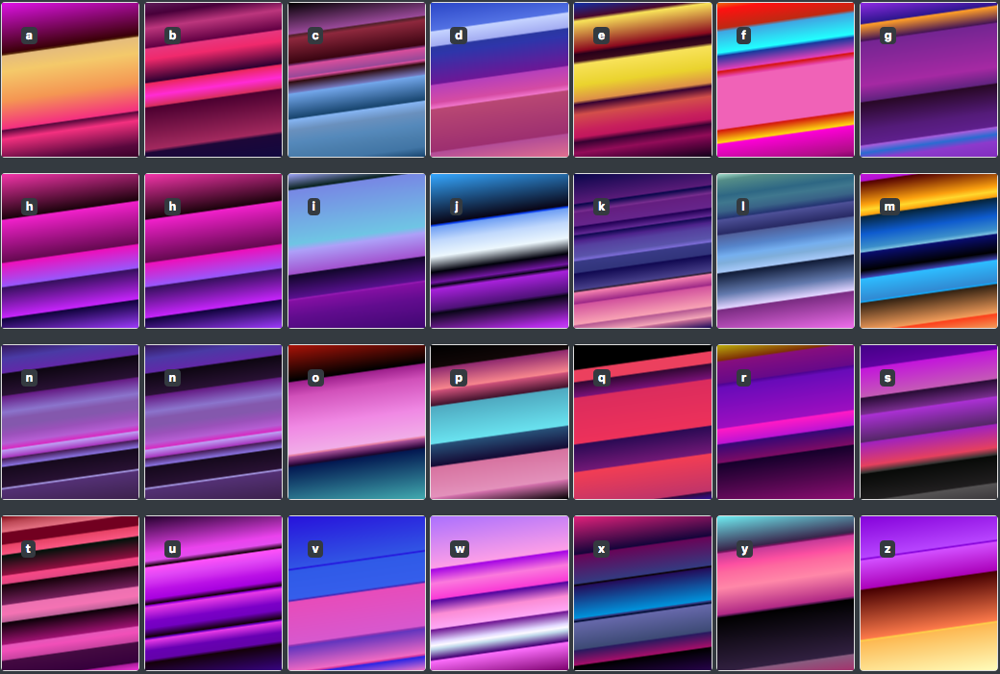
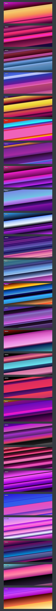

# synthwave
Simple and beautiful synthwave background collection.



## Why?

  Because there is no time to mess with gradient editors.

## Demo & Example

- [demo preview of all styles](https://rawgit.com/fantasyui-com/synthwave/master/demo.html)
- [usage example with UI components](https://rawgit.com/fantasyui-com/synthwave/master/index.html)

## Installation

### NPM

Install Node.js and run ```npm i synthwave```.
```html

<link rel='stylesheet' href='node_modules/synthwave/style.css' />

```

### ZIP

download the zip: https://github.com/fantasyui-com/synthwave/archive/master.zip unpack and put the style.css next to your HTML and simply include the file in your HTML document.

```html

<link rel='stylesheet' href='style.css' />
```

### RAW GIT
Use raw git for development purposes:

```html

<link rel='stylesheet' href='https://rawgit.com/fantasyui-com/synthwave/master/style.css' />

```

### CDN

You can use the raw git CDN for a more permanent 3rd party hosting solution:

```html

<link rel='stylesheet' href='https://cdn.rawgit.com/fantasyui-com/synthwave/master/style.css' />

```

### COPY & PASTE

grab the code from here https://github.com/fantasyui-com/synthwave/blob/master/style.css via copy and paste and put it into a ```<style></style>``` tag of your web page. Which pattern do you like? is it for example synthwave-m? If so then just put this in your ```<head>``` tag:

```CSS

<style>
  .synthwave-m {
    background: linear-gradient(172deg, #C115D7 0%, #B510D6 4%, #540101 5%, #FCA10F 18%, #FFD82D 21%, #FCA10F 24%, #05253D 25%, #0E5BCE 35%, #3C8FCA 43%, #79BFE0 45%, #090D6D 46%, #000002 56%, #3B3FA9 60%, #2DBCFF 61%, #318AD3 73%, #13A7F7 74%, #352313 75%, #F29C5A 91%, #FC411C 92%, #F29C5A 100%);
  }
</style>

```

## API Usage

```JavaScript

const synthwave = require('synthwave');

// Select x CSS
synthwave.css('x')

// Select a,b,c,d CSS
synthwave.css(/[a-d]/)

// Select raw a,b,c objects
synthwave.raw(/[a-c]/)

// Render raw
let allRaw = synthwave.raw(/[cwmfjordbankglyphsvextquiz]/);
let allCss = synthwave.render(allRaw) // -> CSS

```

## HTML Usage

Use synthwave-```a-z``` class in a html node, for example:

```html

<div class="synthwave-b">
  <span class="badge badge-dark">Hello World</span>
</div>


```

Add this to your HTML if you want to apply synthwave to HTML body.
```css

html, body { height: 100%;}
body { background-attachment: fixed !important; }

```



## Developer Notes

git/.config remote origin holds to ease gh-pages publication

    push = +refs/heads/master:refs/heads/gh-pages
    push = +refs/heads/master:refs/heads/master


index.src.html is compiled to index.html via PostHTML

npm run watch
parcel watch index.html.src.js --out-dir . --out-file index.html.js

### Terminal Setup

1. hs -c-1 .
2. node dev-watch.js
3. parcel watch index.html.src.js --out-dir . --out-file index.html.js
